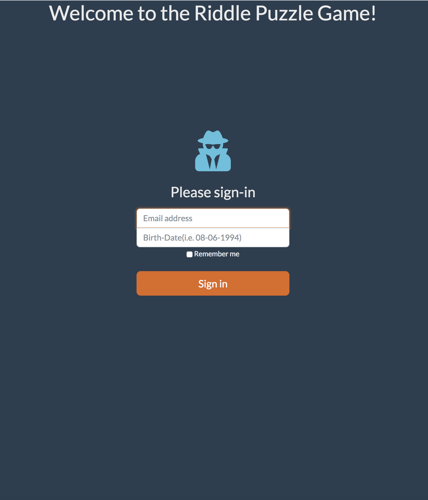
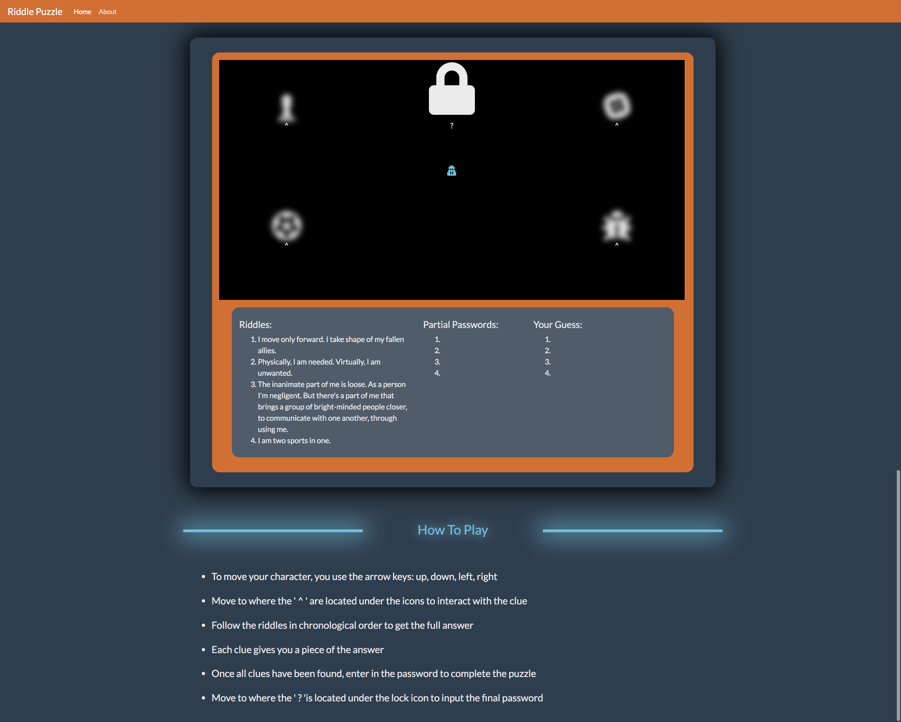
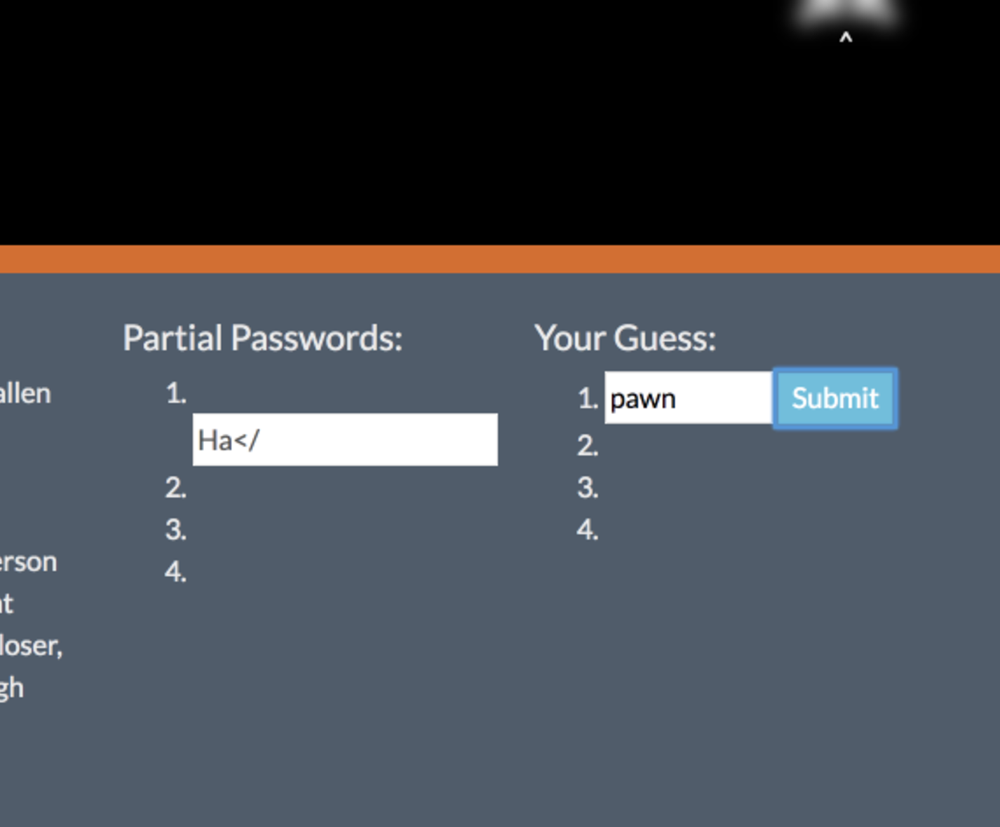
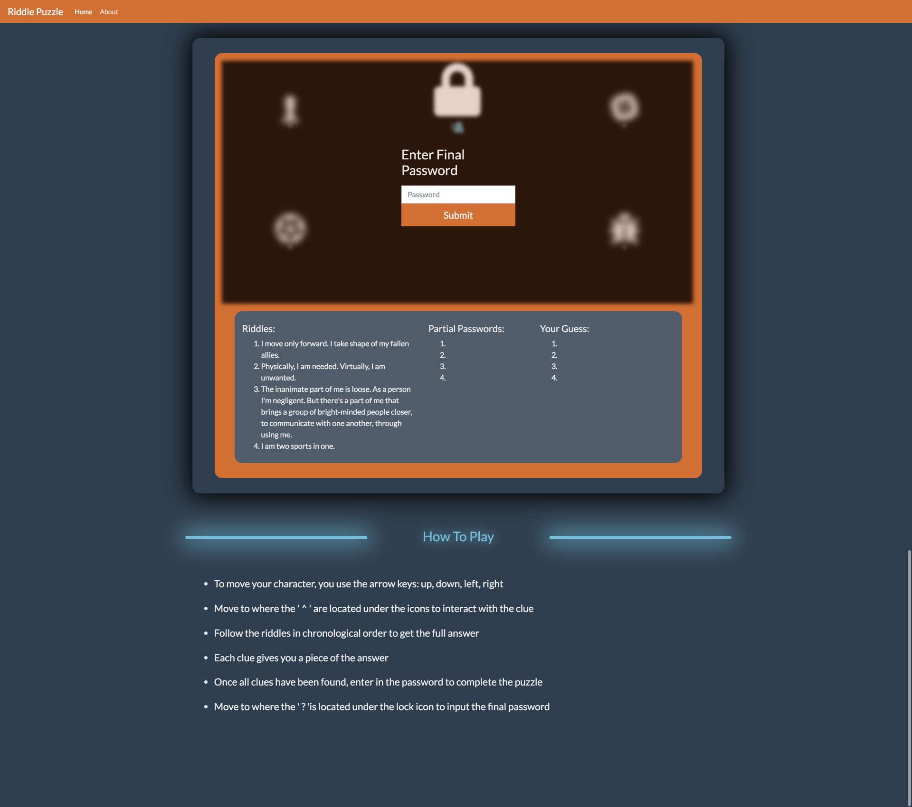

# Frontend-Project
A little puzzle riddle game that has the user interacting and looking for the clues.

## Installation
-Fork and clone this repository

## Login

## Puzzle outlook

## Instructions
- To move your character, you use the arrow keys: up, down, left, right

- Move to where the "^" are located under the icons to interact with the clue

- Follow the riddles in order to get the partial answer

- Each clue gives you a piece of the answer, chronologically

- Once all clues have been found, enter in the password to pass!

